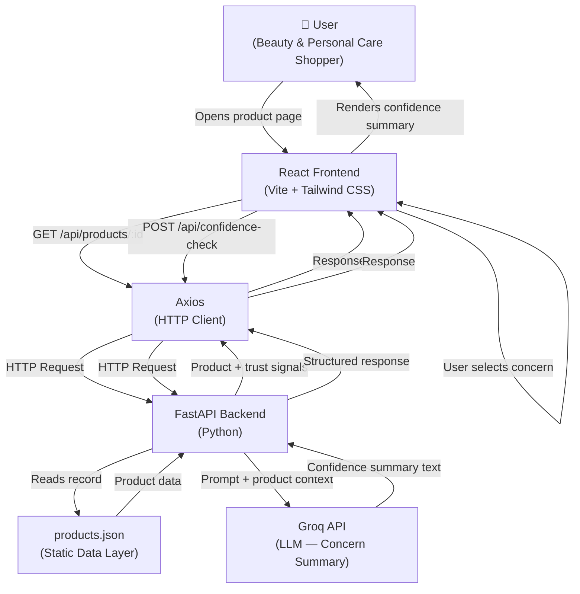

# Architecture — Blinkit Confidence Experience (AI-Native MVP)

> **Source of Truth:** `docs/problem_statement.md`
> This document describes the system architecture for the AI-Native MVP that eliminates the purchase-confidence gap on Blinkit's Beauty & Personal Care product pages.

---

## 1. Overview

The Blinkit Confidence Experience MVP is a **single-surface, AI-augmented Product Detail Page (PDP)** for Beauty & Personal Care products. Its sole purpose is to reduce purchase hesitation at the moment of decision — not to redesign discovery, checkout, or any other surface.

The system is composed of three layers:

| Layer | Technology | Role |
|---|---|---|
| **Frontend** | React + Vite + Tailwind CSS | Renders the PDP with embedded confidence components |
| **Backend** | FastAPI (Python) | Serves product data; proxies Groq AI requests |
| **AI** | Groq API | Generates concern-driven confidence summaries in real time |

All product data is sourced exclusively from a static `products.json` file. There is no database, no user authentication, and no personalization engine in scope.

---

## 2.  Architecture Principles

This architecture is guided by the following principles:

- Engineer Purchase Confidence, not Product Discovery.
- Keep the shopping experience fast and low-friction.
- Use AI only to reduce purchase hesitation.
- Prefer simple, maintainable architecture for the MVP.
- Minimize dependencies and infrastructure complexity.

---

## 3. High-Level Architecture



---

## 4. Frontend Architecture

The frontend is a **React single-page application** built with Vite and styled using Tailwind CSS. It renders a single Product Detail Page surface with embedded confidence components.

### 4.1 Rendering Strategy

- **React + Vite** — component-based UI with fast dev server and optimised production build.
- **Tailwind CSS** — utility-first styling applied at the component level; no custom CSS files.
- **Axios** — all HTTP communication with the FastAPI backend is handled through a shared Axios instance.
- State is managed locally within React components using `useState` and `useEffect`. No global state library is required for the MVP.

### 4.2 Concern Categories (UI Inputs)

The concern selector maps directly to the four trust barriers identified in user research:

| Concern Label | Trust Barrier Addressed |
|---|---|
| Authenticity | Users question whether the product is genuine |
| Suitability | Users unsure if the product matches their specific needs |
| Quality | Users distrust quality without external third-party validation |
| Returns | Users want assurance about replacement and return policies |

### 4.3 Pages

| Route | Purpose |
|---|---|
| `/` | Product listing — entry point for the MVP |
| `/products/:id` | Product Detail Page — the primary MVP surface |

---

## 5. Backend Architecture

The backend is a **lightweight FastAPI application** whose only responsibilities are:

1. Reading and serving product data from `products.json`
2. Constructing a concern-specific prompt from the product record
3. Forwarding the prompt to the Groq API
4. Returning a structured confidence summary to the frontend

### 5.1 API Endpoints

| Method | Endpoint | Description |
|---|---|---|
| `GET` | `/api/products` | Returns all Beauty & Personal Care products |
| `GET` | `/api/products/{id}` | Returns a single product with all trust signal fields |
| `POST` | `/api/confidence-check` | Accepts `{ product_id, concern }` and returns an AI-generated summary |

### 5.2 Request / Response Contract

**POST `/api/confidence-check`**

Request body:

```json
{
  "product_id": "bpc-001",
  "concern": "authenticity"
}
```

Response body:

```json
{
  "concern": "authenticity",
  "summary": "This product is sourced directly from brand-authorized distributors...",
  "trust_signals": ["Sealed packaging guaranteed", "Easy 7-day returns"]
}
```

### 5.3 Groq Integration (Backend Responsibility)

The backend constructs a concern-specific prompt by combining the product's `concernContext` field with the selected concern, then calls the Groq Chat Completions API. The response is parsed and returned to the frontend as a structured JSON object.

**Failure Handling:** If the Groq call fails or times out, the backend falls back to the static `concernContext` value from `products.json` and returns it as the summary, without exposing the error to the frontend.

---

## 6. Data Flow

### 6.1 Page Load Flow

```
1. User navigates to /products/:id in the browser
2. React component mounts and triggers Axios GET /api/products/{id}
3. FastAPI reads the matching product record from products.json
4. FastAPI returns the product object (name, brand, price, images, trustSignals)
5. React renders ProductHeader, TrustSignals, and an empty AIConfidenceCheck panel
```

### 6.2 AI Confidence Check Flow

```
1. User selects a concern (e.g., "Authenticity") in the ConcernSelector
2. React triggers Axios POST /api/confidence-check with { product_id, concern }
3. FastAPI reads the product's concernContext for that concern
4. FastAPI constructs a concern-specific prompt and calls the Groq API
5. Groq returns a completion string
6. FastAPI attaches relevant trustSignals from the product record
7. FastAPI returns the structured response to Axios
8. React renders the ConfidenceSummaryCard with the AI-generated text
```

---

## 7. Component Hierarchy

```
App
└── Router
    ├── ProductListingPage          /
    │   └── ProductCard (×n)
    │
    └── ProductDetailPage           /products/:id
        ├── ProductHeader
        │   ├── ProductImage
        │   ├── ProductName
        │   ├── ProductBrand
        │   └── PriceDisplay
        │
        ├── TrustSignals
        │   ├── AuthenticityBadge          ← Authenticity assurance signal
        │   ├── ReturnPolicyBadge          ← Risk-free purchase assurance
        │   └── LocalConfidenceSignal      ← Delivery speed / sourcing cue
        │
        ├── AIConfidenceCheck              ← Core MVP feature
        │   ├── ConcernSelector            ← User picks concern
        │   ├── ConfidenceSummaryCard      ← AI-generated concern summary
        │   └── LoadingSpinner             ← Shown during Groq API call
        │
        └── AddToCartCTA
```

---

## 8. Data Layer — `products.json`

All product data for the MVP is stored in a single static JSON file read by the FastAPI backend. No database is used.

### 8.1 Product Record Schema

```json
{
  "id": "bpc-001",
  "name": "Minimalist 10% Niacinamide Face Serum",
  "brand": "Minimalist",
  "category": "Beauty & Personal Care",
  "subCategory": "Skincare",
  "price": 599,
  "images": ["url-1.jpg"],
  "description": "...",
  "trustSignals": {
    "authenticity": "Sourced directly from brand-authorized distributors.",
    "returnPolicy": "7-day easy return, no questions asked.",
    "localConfidence": "Delivered in 10 minutes from your nearest dark store."
  },
  "concernContext": {
    "authenticity": "Product arrives in original sealed packaging.",
    "suitability": "Suitable for oily and combination skin types.",
    "quality": "Dermatologically tested. 4.6 stars from 12,000+ reviews.",
    "returns": "Free replacement within 7 days if unsatisfied."
  }
}
```

### 8.2 Design Rationale

- **Static file** removes all database setup overhead for the MVP.
- `concernContext` per product provides grounding for the Groq prompt, ensuring summaries are product-specific rather than generic.
- `trustSignals` are displayed as static UI elements regardless of the AI call outcome.
- The schema is forward-compatible and can be migrated to a database post-MVP without changing the API contract.

---

## 9. Technology Stack

| Layer | Technology | Purpose |
|---|---|---|
| Frontend framework | React 18 | Component-based UI rendering |
| Build tool | Vite | Fast development server; optimised production build |
| Styling | Tailwind CSS | Utility-first styling at the component level |
| HTTP client | Axios | All frontend-to-backend API communication |
| Backend framework | FastAPI (Python) | REST API; Groq proxy; products.json serving |
| Data | `products.json` | Sole data source; static file |
| AI | Groq API | Low-latency LLM inference for confidence summaries |
| Dev server | `uvicorn` | FastAPI ASGI server for local development |

---

## 10. Folder Structure

```
blinkit-confidence-mvp/
├── docs/
│   ├── problem_statement.md        # Source of truth
│   └── architecture.md             # This document
│
├── frontend/                       # React + Vite + Tailwind application
│   ├── public/
│   ├── src/
│   │   ├── components/
│   │   │   ├── ProductHeader/
│   │   │   ├── TrustSignals/
│   │   │   │   ├── AuthenticityBadge.jsx
│   │   │   │   ├── ReturnPolicyBadge.jsx
│   │   │   │   └── LocalConfidenceSignal.jsx
│   │   │   ├── AIConfidenceCheck/
│   │   │   │   ├── ConcernSelector.jsx
│   │   │   │   ├── ConfidenceSummaryCard.jsx
│   │   │   │   └── LoadingSpinner.jsx
│   │   │   ├── ProductCard.jsx
│   │   │   └── AddToCartCTA.jsx
│   │   ├── pages/
│   │   │   ├── ProductListingPage.jsx
│   │   │   └── ProductDetailPage.jsx
│   │   ├── api/
│   │   │   └── client.js           # Axios instance and API call functions
│   │   ├── App.jsx
│   │   └── main.jsx
│   ├── index.html
│   ├── tailwind.config.js
│   ├── vite.config.js
│   └── package.json
│
├── backend/                        # FastAPI (Python) application
│   ├── main.py                     # FastAPI app entry point
│   ├── routers/
│   │   ├── products.py             # GET /api/products, GET /api/products/{id}
│   │   └── confidence.py           # POST /api/confidence-check
│   ├── services/
│   │   └── groq_service.py         # Prompt builder + Groq API client
│   ├── data/
│   │   └── products.json           # All Beauty & Personal Care product records
│   └── requirements.txt
│
├── .env                            # GROQ_API_KEY (not committed)
└── README.md
```

---

## 11. Scope Boundaries

This architecture strictly implements what is defined as **in-scope** in the Problem Statement.

### Included in This Architecture

| Feature | Component(s) |
|---|---|
| Beauty & Personal Care product pages | `products.json`, `ProductDetailPage`, `ProductCard` |
| Product Detail Page experience | All components under `ProductDetailPage` |
| AI Confidence Check (concern-driven summary) | `AIConfidenceCheck`, `POST /api/confidence-check`, `groq_service.py` |
| Authenticity Assurance | `AuthenticityBadge`, `trustSignals.authenticity` in product record |
| Trust Signals | `TrustSignals` component group, `trustSignals` fields in product record |
| Local Confidence Signals | `LocalConfidenceSignal`, `trustSignals.localConfidence` |
| Risk-Free Purchase Assurance | `ReturnPolicyBadge`, `trustSignals.returnPolicy` |

### Explicitly Excluded

| Out-of-Scope Feature | Why Absent |
|---|---|
| Shopping chatbot | AI is concern-specific only, not conversational |
| Personalized / algorithmic recommendations | No user profiles; no recommendation engine |
| Checkout redesign | Only the PDP surface is in scope |
| Loyalty program | No user account layer exists |
| Inventory optimization | Backend reads static data only |
| Search improvements | No search surface in scope |
| Cart experience | Add-to-Cart CTA is present; no cart implementation |
| Delivery optimization | Delivery cue is a static trust signal only |

---

*Architecture version: 2.0 — Stack: React + Vite + Tailwind CSS · FastAPI (Python) · Axios · Groq API · products.json*
